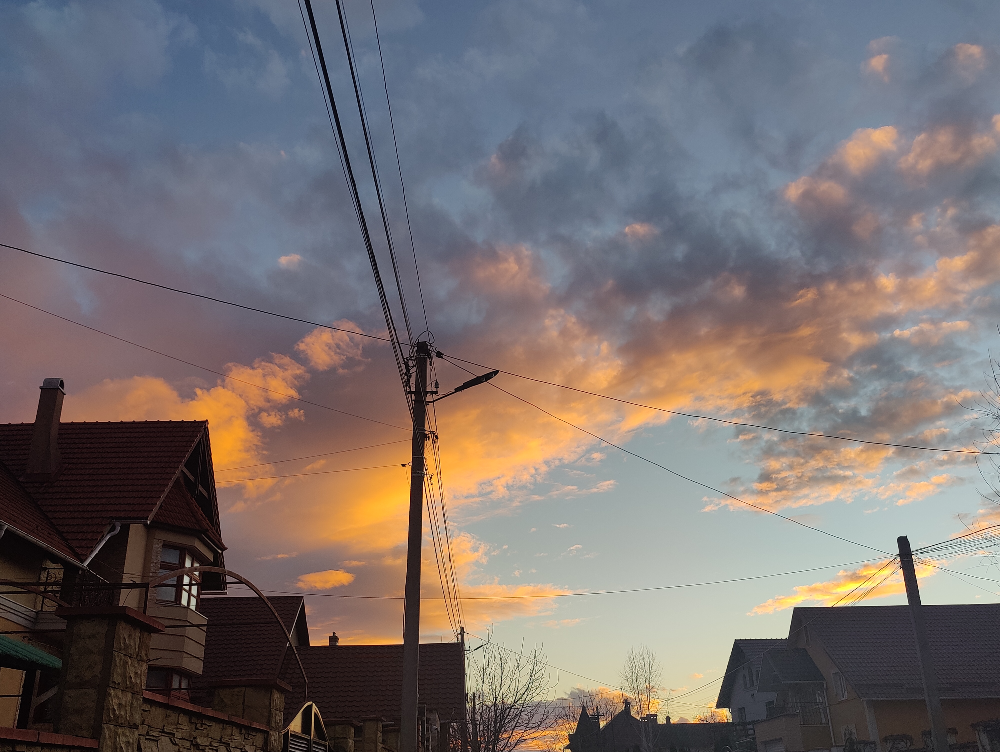

# Template Portfolio
This will be your portfolio repository. Use this as a [template repository](https://docs.github.com/en/repositories/creating-and-managing-repositories/creating-a-template-repository) and customize it to your own tastes. We gave you a starting point with a space to describe yourself and a link to where your assignment 1 file can be.

# About Me
My name is Madalina Griza. I am a senior majoring in 6-3. I am from the [Republic of Moldova](https://en.wikipedia.org/wiki/Moldova).

*I really like taking pictures of clouds. Here's one!*

For this class I want to learn more about what is good design, and apply it both in class and in my future SWE work. 
# Table of Contents
- [Link to Assignment 1](assignments/assignment1.md)
- [Link to Assignment 2](assignments/assignment2.md)
